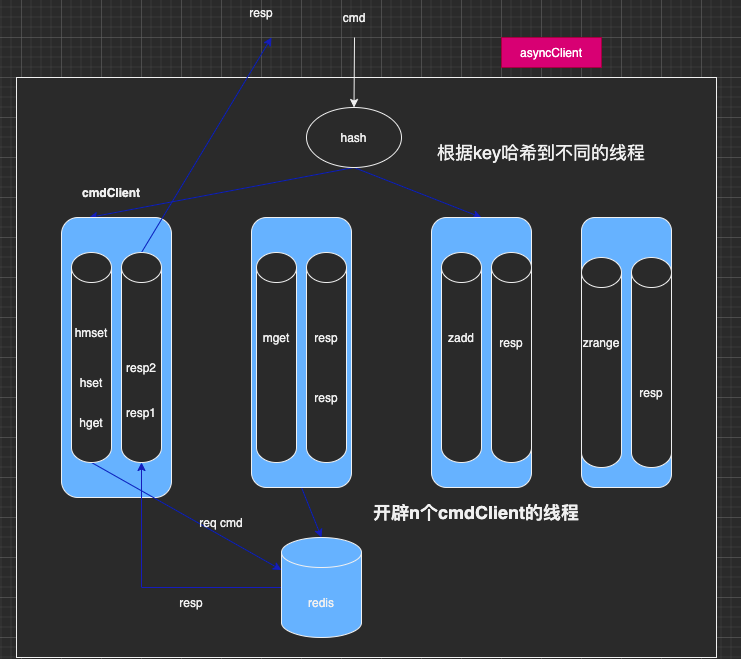

# sync client
```` 
  1.一个redis client操作的封装,用于操作redis,可以根据需求更换redis实现
  2.可支持redis的所有命令
  
```` 
# async client
````
  1.支持异步操作
  2.支持多线程写命令
  3.异步写入，支持回调
  
  ````
# how to use
````
  见test使用案列
````
## async client设计目的：redis的执行命令不阻塞业务逻辑主线程，并支持回调结果

# async client架构图  
